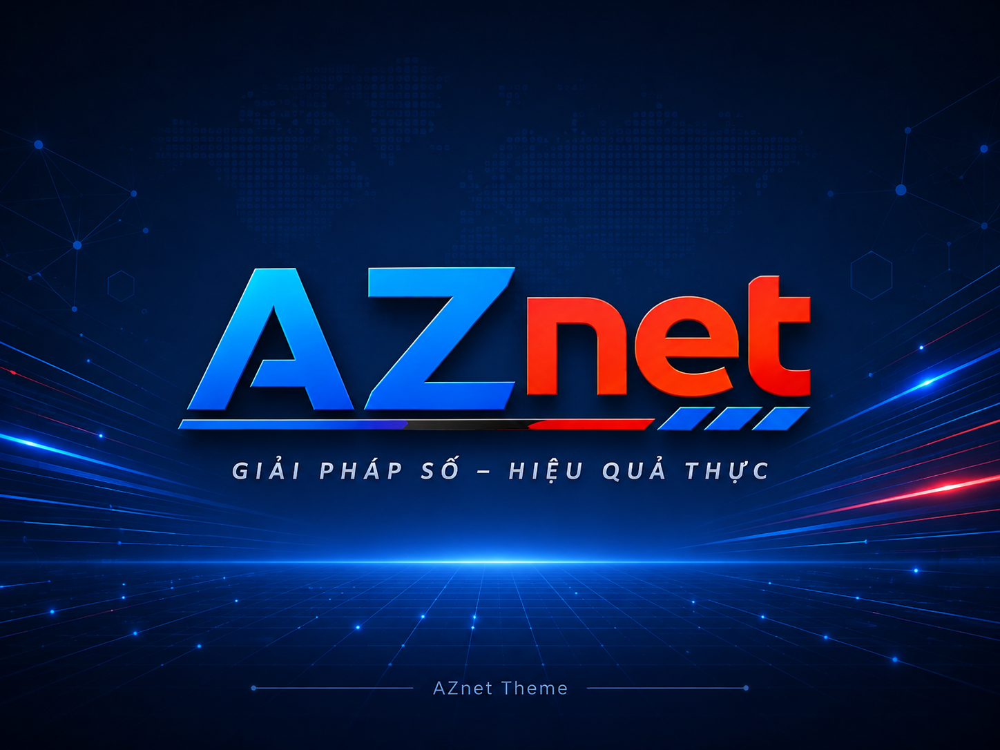

# AZnet Theme

AZnet Theme là WordPress house/reference theme của AZnet, tập trung vào presentation và tích hợp qua public contracts. Theme không sở hữu business/domain state của RootProfile, ConvertFlow hoặc WooCommerce.

Phiên bản hiện tại: `1.0.0`

## Kiến trúc

- Hybrid PHP theme + `theme.json`.
- PHP template hierarchy tiếp tục là nguồn composition cho v1.x.
- `theme.json` cung cấp settings, styles và semantic token mapping; không được dùng để suy ra rằng Theme đã chuyển sang Full Site Editing template ownership.
- PHP modular dưới `inc/theme/*` và `inc/integrations/*`.
- Assets được enqueue theo surface/capability thay vì nạp toàn bộ ecosystem globally.

## Tính năng hiện có

- Semantic CSS custom properties theo family `--aznet-theme-*`.
- Header/Footer presentation của Theme.
- Generic Page/Post/Archive/Search/404 templates.
- RootProfile presentation consumers/adapters theo public provider contracts; production takeover vẫn là gate riêng.
- WooCommerce presentation cho Product, Archive, Cart, Checkout và My Account bằng hooks/CSS/Blocks-first; WooCommerce tiếp tục sở hữu commerce truth/state.

## Yêu cầu

- WordPress >= 6.9
- PHP >= 8.1
- WooCommerce là dependency tùy chọn cho commerce surfaces.

## Cài đặt nhanh

```bash
git clone https://github.com/truongdinhnamaz/aznet-theme.git
cp -r aznet-theme /path/to/wordpress/wp-content/themes/
```

Kích hoạt qua WordPress Admin (`Appearance -> Themes`) hoặc WP-CLI:

```bash
wp theme activate aznet-theme
```

## Nội dung mẫu

Repository có thể chứa fixture phục vụ kiểm thử/tài liệu dưới `docs/fixtures/`. Fixture không phải production Theme data và không chuyển ownership của WordPress/WooCommerce/RootProfile/ConvertFlow sang Theme.

## Source governance

Source đã được chấp nhận là baseline cố định cho implementation; tiến độ sống được xác định từ GitHub code/PR/CI/evidence, không bằng cách tạo source version mới sau mỗi checkpoint. Quy tắc đầy đủ nằm tại [`docs/SOURCE_GOVERNANCE.md`](docs/SOURCE_GOVERNANCE.md).

README chỉ là điểm dẫn nhập và không thay thế source owner theo chủ đề.

## Phát triển

Mọi thay đổi production cần giữ đúng source ownership, public integration boundary và QA layer tương ứng. Không suy diễn static/contract PASS thành runtime/browser/integration/release PASS.

Canonical repository: `truongdinhnamaz/aznet-theme`.
